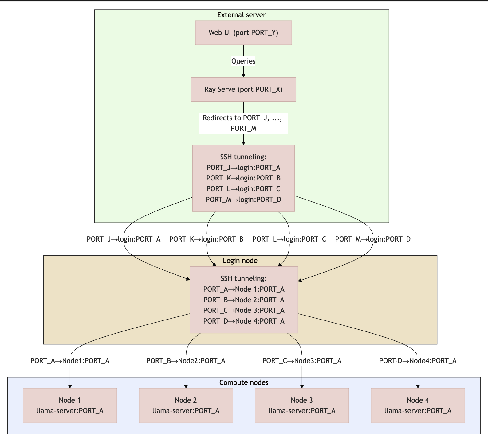

# Orchestration with Ray Serve



The `chat_router.py` file, located in the `ray/` folder, implements an **intelligent router** based on Ray Serve to distribute chat requests across different inference nodes (`llama-server` servers). This component is essential for environments with multiple GPU nodes, ensuring load balancing, per-node context control, and conversation consistency.

---

## Objective

- Route requests to multiple model APIs running on independent nodes.
- Balance token usage in the context of each node, respecting GPU memory limits.
- Dynamically adapt the user prompt using a sliding window mechanism.
- Support response streaming with `text/event-stream`.

---

## How to Run

Before running, create a `.env` file with the available node configurations:

### `.env` Example

```env
# .env

# Maximum context tokens for each node
NODE1_MAX_CONTEXT=8192
NODE2_MAX_CONTEXT=8192
NODE3_MAX_CONTEXT=8192
NODE4_MAX_CONTEXT=8192

# Endpoints of the llama-server instances
NODE1_ENDPOINT=http://localhost:PORT_A/v1/chat/completions
NODE2_ENDPOINT=http://localhost:PORT_B/v1/chat/completions
NODE3_ENDPOINT=http://localhost:PORT_C/v1/chat/completions
NODE4_ENDPOINT=http://localhost:PORT_D/v1/chat/completions

# API keys for authentication
NODE1_API_KEY=
NODE2_API_KEY=
NODE3_API_KEY=
NODE4_API_KEY=
```

> 🔒 API keys are mandatory. If you're not using authentication, you can leave the fields empty, but the names must be present in the `.env`.

---

## Starting the Router

With the `.env` correctly configured, run:

```bash
serve run chat_router:app
```

This command starts the router as a Ray Serve application that will listen for HTTP requests compatible with the `/v1/chat/completions` endpoint.

---

## How It Works

### Configuration Reading

- The router dynamically loads the `NODE{i}_ENDPOINT`, `NODE{i}_API_KEY`, and `NODE{i}_MAX_CONTEXT` variables from the `.env`.
- Each node is registered as an instance of the `Node` class, containing:
  - Request endpoint;
  - API key;
  - Maximum token limit per prompt + response.

### Token Counter

- Uses a `tokenizer.json` (compatible with `transformers`/`huggingface`) to calculate the total number of tokens in each prompt.
- The `_count_tokens()` method simulates the actual token count sent to the model.

### Node Selection

- Node selection is done via round-robin using `_next_node()`, with an asynchronous lock (`asyncio.Lock`) to avoid race conditions.

### Sliding Window

- The prompt is dynamically truncated to fit the allowed token limit.
- If the history is too long, the oldest messages are removed in chunks (sliding window).
- If the final `user_message` still exceeds the limit, it is directly truncated by tokens.

### Sending and Streaming

- The payload is forwarded to the model’s endpoint via `aiohttp`.
- Responses are streamed in real time as a `StreamingResponse` using `text/event-stream`.

---

## Requirements

- Python 3.10+
- Libraries:
  - `aiohttp`
  - `python-dotenv`
  - `pydantic`
  - `ray[serve]`
  - `tokenizers`
  - `starlette`

Install with:

```bash
pip install aiohttp python-dotenv pydantic ray[serve] tokenizers starlette
```

---

## Expected Request Format

The request to `chat_router` must follow the following JSON format:

```json
{
  "messages": [
    {"role": "system", "content": "You are a helpful assistant."},
    {"role": "user", "content": "Hello, who are you?"}
  ],
  "stream": true,
  "temperature": 0.7,
  "top_p": 0.9,
  "max_tokens": 8192
}
```

> ⚠️ The last message **must** be of type `"role": "user"`, otherwise the request will be rejected.

---

## Logs

The script generates detailed logs for:

- Number of tokens calculated;
- Performed truncations;
- Node selected for inference;
- Connection or validation errors.

---

## Shutdown

To safely shut down the router, the `shutdown()` method closes the active HTTP session from `aiohttp`.


